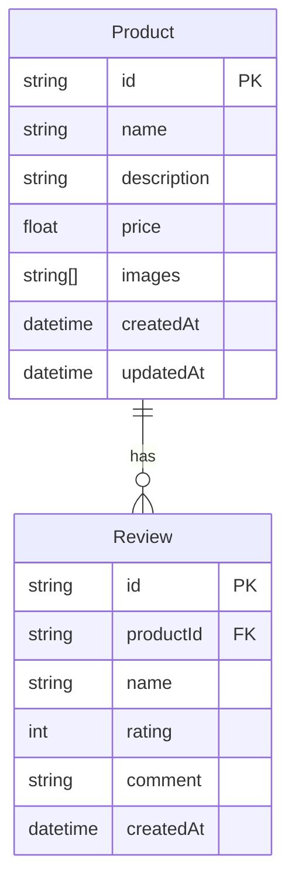

# 🗄️ Database Library

Library ini bertanggung jawab untuk mengelola skema database, migrasi, dan penyediaan `PrismaService` untuk seluruh aplikasi dalam monorepo.

## 📊 Entity Relationship Diagram (ERD)

Berikut adalah visualisasi hubungan antar tabel menggunakan Mermaid:

## 📝 Detail Skema

### 1. Product

Tabel utama untuk menyimpan informasi produk.

- **id**: UUID (Primary Key).
- **name**: Nama produk.
- **description**: Deskripsi opsional.
- **price**: Harga produk (Float).
- **images**: Array string untuk URL gambar.
- **reviews**: Relasi One-to-Many ke tabel `Review`.

### 2. Review

Tabel untuk menyimpan ulasan dari pengguna untuk produk tertentu.

- **id**: UUID (Primary Key).
- **productId**: Foreign Key ke `Product.id`.
- **name**: Nama pemberi ulasan.
- **rating**: Skor rating (Integer).
- **comment**: Komentar opsional.

## 🚀 Perintah Berguna

Library ini memiliki beberapa target Nx yang dapat dijalankan:

- `nx db-migrate database`: Menjalankan migrasi Prisma.
- `nx db-generate database`: Generate Prisma Client.
- `nx db-seed database`: Menjalankan seeding data dummy.
- `nx db-studio database`: Membuka Prisma Studio GUI.
- `nx db-setup database`: Menjalankan urutan setup lengkap (init, migrate, generate, seed).
